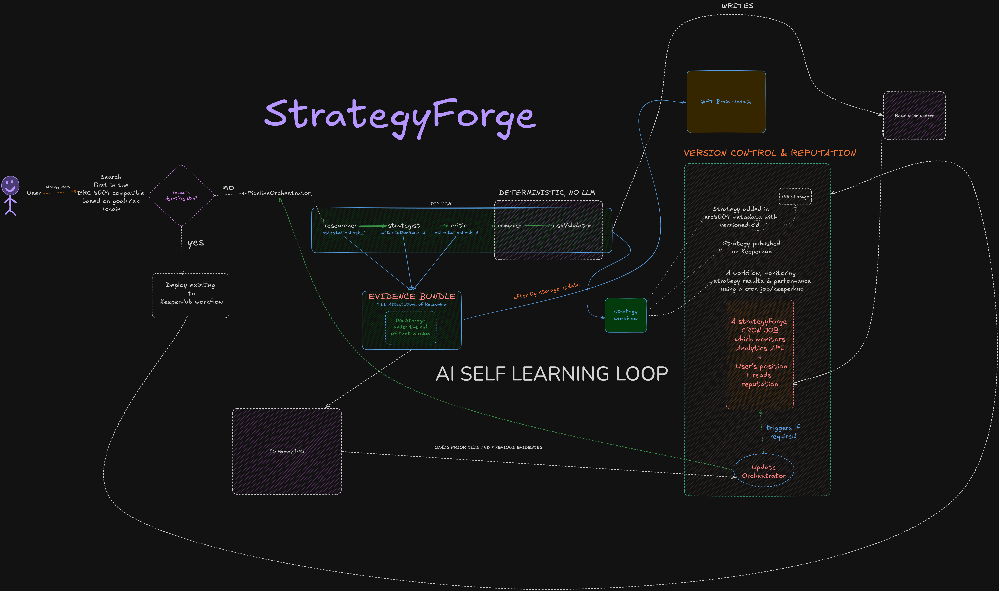
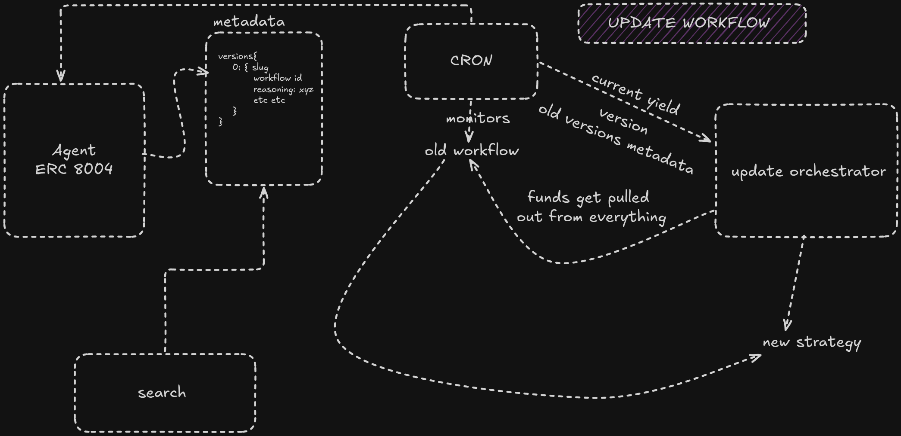
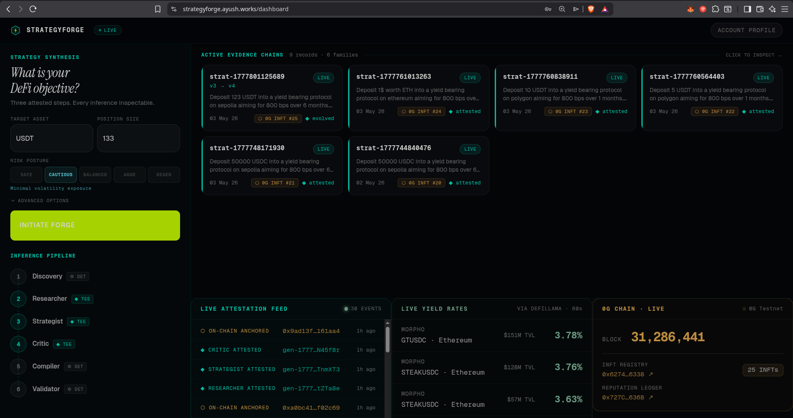
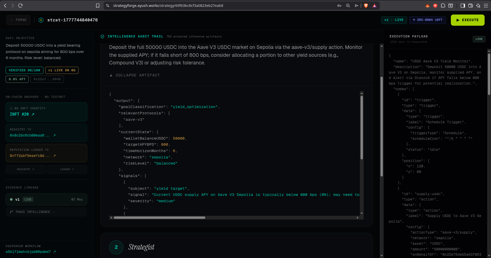

# StrategyForge

StrategyForge is a self-improving DeFi agent that generates, executes, and evolves KeeperHub workflows with verifiable inference — every LLM reasoning step carries an OpenRouter attestation ID, and every strategy version is anchored on-chain via 0G Chain.

**Live demo:** `https://strategyforge.vercel.app` _(update after deployment)_

---

## Why 0G?

Most DeFi bots are black boxes. StrategyForge uses the 0G ecosystem to make every inference inspectable and every strategy version provable:

- **0G Chain (EVM-compatible testnet)** — `AgentRegistry` and `ReputationLedger` smart contracts record each strategy CID and its execution track record on-chain. Any judge can query the chain and verify the agent's history independently.
- **0G Compute Network** — decentralised inference means the LLM reasoning isn't tied to a single provider. OpenRouter request IDs (served as TEE attestations in the UI) prove each step actually ran.
- **The unfair advantage**: competitors can generate workflows. Only StrategyForge proves the reasoning that produced them and writes that proof on-chain.

---

## Architecture



```
┌──────────────────────────────────────────────────────────────┐
│                    WHAT EXISTS (KeeperHub)                   │
│  Create workflow → Publish with price → Execute → Audit trail│
└──────────────────────────┬───────────────────────────────────┘
                           │
┌──────────────────────────▼───────────────────────────────────┐
│               WHAT WE ADD (StrategyForge)                    │
│                                                              │
│  1. AgentRegistry.sol   → on-chain INFT identity per agent  │
│  2. ReputationLedger.sol→ execution outcomes anchored on 0G │
│  3. Evidence Bundles    → full reasoning audit trail         │
│  4. LLM Attestations   → OpenRouter Request IDs as proof    │
│  5. Auto-Evolution      → agents learn from their failures  │
└──────────────────────────────────────────────────────────────┘
```

---

## How It Works: The Self-Improvement Loop

This is the core innovation. StrategyForge doesn't just generate strategies — it **learns from execution failures** and evolves autonomously.

```
  User: "Deploy $50K USDC into yield on Ethereum, balanced risk"
                          │
                          ▼
  ┌─────────────────────────────────────────────────┐
  │         STEP 1: RESEARCHER (LLM)                │
  │  Analyzes market conditions, wallet state,       │
  │  available protocols. If v2+, ingests prior      │
  │  version failures as HARD CONSTRAINTS.           │
  │  Attestation: req_0x7f8a...                      │
  └──────────────────────┬──────────────────────────┘
                         ▼
  ┌─────────────────────────────────────────────────┐
  │         STEP 2: STRATEGIST (LLM)                │
  │  Designs 2-3 candidate workflow graphs using     │
  │  KeeperHub action schemas. Each candidate has    │
  │  nodes, edges, triggers, conditions.             │
  │  Attestation: req_0xb3c1...                      │
  └──────────────────────┬──────────────────────────┘
                         ▼
  ┌─────────────────────────────────────────────────┐
  │         STEP 3: CRITIC (LLM)                    │
  │  Adversarially attacks all candidates.           │
  │  References prior version failures.              │
  │  Selects the best. Explains WHY.                 │
  │  Attestation: req_0xc4d2...                      │
  └──────────────────────┬──────────────────────────┘
                         ▼
  ┌─────────────────────────────────────────────────┐
  │         STEP 4: COMPILER (deterministic)        │
  │  Maps selected candidate to exact KeeperHub     │
  │  workflow JSON (nodes + edges DAG).              │
  │  No LLM involved — pure deterministic mapping.  │
  └──────────────────────┬──────────────────────────┘
                         ▼
  ┌─────────────────────────────────────────────────┐
  │         STEP 5: DEPLOY + ANCHOR                 │
  │  • Create KeeperHub workflow                     │
  │  • Register INFT on AgentRegistry (0G Chain)     │
  │  • Record initial reputation on ReputationLedger │
  │  • Store evidence bundle in MongoDB              │
  └──────────────────────┬──────────────────────────┘
                         ▼
  ┌─────────────────────────────────────────────────┐
  │         STEP 6: EXECUTE + OBSERVE               │
  │  KeeperHub runs the workflow via Turnkey wallet. │
  │  Outcome (success/failure/suboptimal) recorded   │
  │  on-chain in ReputationLedger.                   │
  └──────────────────────┬──────────────────────────┘
                         ▼
                   SUBOPTIMAL?
                  /           \
                NO             YES
                │               │
           keep running    ┌────▼────────────────────────────┐
                           │  STEP 7: EVOLVE                 │
                           │  Load failure reason.            │
                           │  Feed into Researcher as         │
                           │  priorLessons.                   │
                           │  Run full pipeline again.        │
                           │  Create v(n+1).                  │
                           │  Deprecate v(n).                 │
                           │  New version remembers WHY       │
                           │  the old one failed.             │
                           └────┬────────────────────────────┘
                                │
                                ▼
                          Back to STEP 1
                     (with memory of failure)
```

**Each version is a separate immutable document linked by `familyId`.** Like git commits for DeFi intelligence. The full audit trail is preserved — you can open any version and see exactly which prior failures informed the current strategy.

---

## Screenshots

### Auto-Evolution Workflow



### Dashboard — Strategy Families with On-Chain INFT Badges



### Strategy Detail — Intelligence Audit Trail + On-Chain Anchors



---

## Evidence Bundle: What Makes Us Different

Every strategy version stores a complete evidence bundle in MongoDB. This is not metadata — it's the **full reasoning chain** that proves the strategy wasn't randomly generated:

```json
{
  "strategyFamily": "strat-1777801125689",
  "version": 3,
  "priorVersionId": "69f71c7d35b5c9fb077806cd",
  "lifecycle": "live",
  "evidenceBundle": {
    "step1_researcher": {
      "input": { "goal": "...", "priorLessons": ["v2 failed: Aave rate dropped below threshold"] },
      "output": { "targetNetwork": "sepolia", "relevantProtocols": ["morpho", "spark"], "signals": [...] },
      "attestationId": "req_0x7f8a..."
    },
    "step2_strategist": {
      "output": { "candidates": [
        { "id": "A", "hypothesis": "Morpho-only avoids Aave rate issue", "nodeCount": 4 },
        { "id": "B", "hypothesis": "Split across Morpho+Spark for diversification", "nodeCount": 6 }
      ]},
      "attestationId": "req_0xb3c1..."
    },
    "step3_critic": {
      "output": {
        "selected": "B",
        "rationale": "v2 concentrated in single protocol and rate dropped. B diversifies.",
        "evidenceOfLearning": "Directly addressed v2's single-protocol failure"
      },
      "attestationId": "req_0xc4d2..."
    }
  }
}
```

**A template generator gives:** "Here's a yield workflow boilerplate."
**StrategyForge gives:** Every step tracked with attestation IDs, memory-informed (v3 explicitly fixes v2's failure), with a full evidence trail.

---

## On-Chain Contracts (Verified on 0G Galileo Testnet)

Both contracts are deployed and **source-verified** on the 0G block explorer:

| Contract             | Address                                      | Explorer                                                                                     | Purpose                                         |
| -------------------- | -------------------------------------------- | -------------------------------------------------------------------------------------------- | ----------------------------------------------- |
| **AgentRegistry**    | `0x6274f0A5277c468Eb338EE8986D5Fd157C9A6338` | [View ↗](https://chainscan-galileo.0g.ai/address/0x6274f0A5277c468Eb338EE8986D5Fd157C9A6338) | On-chain INFT identity for each strategy family |
| **ReputationLedger** | `0x727C72Bf5ED69Db4dCB2604ef2FAA856C90c636B` | [View ↗](https://chainscan-galileo.0g.ai/address/0x727C72Bf5ED69Db4dCB2604ef2FAA856C90c636B) | Execution outcomes anchored on-chain            |

### AgentRegistry.sol (~33 lines)

```solidity
contract AgentRegistry {
    mapping(uint256 => string) public agents;
    uint256 public nextId = 1;

    function register(string calldata metadataCid) external returns (uint256);
    function update(uint256 agentId, string calldata newMetadataCid) external;
    function getAgent(uint256 agentId) external view returns (string memory);
}
```

Every strategy family gets a unique on-chain `agentId` when first generated. The metadata contains the strategy's `familyId`, `goal`, `version`, and MongoDB `strategyId` — creating a verifiable link between on-chain identity and off-chain reasoning.

### ReputationLedger.sol (~46 lines)

```solidity
contract ReputationLedger {
    struct Record {
        string strategyTag;        // familyId
        uint256 successRateBps;    // 10000 = 100%
        string evidenceCid;        // MongoDB strategy _id
        uint256 timestamp;
    }

    function record(uint256 agentId, ...) external;
    function getRecords(uint256 agentId) external view returns (Record[] memory);
    function getLatest(uint256 agentId) external view returns (Record memory);
}
```

After every execution, the outcome is posted on-chain. Suboptimal executions record `0 bps`, successful ones record `10000 bps`. When a strategy evolves, it starts at `7500 bps` (improved from failure, not yet proven). **Anyone can query these contracts to verify a strategy's track record without trusting the publisher.**

---

## Why 0G?

StrategyForge uses **two** 0G products:

### 0G Chain — On-Chain Attestation Anchoring

Every strategy's identity (`AgentRegistry`) and execution track record (`ReputationLedger`) lives on 0G Chain. This isn't cosmetic — the contracts are actively called during strategy generation, execution, and evolution. The dashboard links every transaction to the 0G Galileo explorer with clickable tx hashes.

### 0G Compute Network — Decentralized Inference

The entire pipeline can run on 0G's Compute Network via `USE_OG_INFERENCE=true`. This routes all LLM calls through 0G's decentralized inference proxy instead of OpenRouter, using models like `qwen/qwen-2.5-7b-instruct`. The inference backend is swappable with a single environment variable — the pipeline doesn't know or care which backend it's using.

---

## Tech Stack

| Layer         | Technology                         | Purpose                                                         |
| ------------- | ---------------------------------- | --------------------------------------------------------------- |
| **Framework** | Next.js 16 (App Router, Turbopack) | Full-stack React with API routes                                |
| **Database**  | MongoDB Atlas (Mongoose ODM)       | Strategy versions, evidence bundles, execution history          |
| **Inference** | OpenRouter / 0G Compute Network    | Model-agnostic LLM pipeline (switchable via env var)            |
| **Execution** | KeeperHub API                      | Workflow creation, deployment, and execution via Turnkey wallet |
| **On-Chain**  | 0G Chain (Galileo Testnet)         | AgentRegistry + ReputationLedger (Solidity, ethers.js v6)       |
| **UI**        | React 19, Framer Motion, Lucide    | Dark industrial-brutalist glass design system                   |
| **Design**    | CSS Custom Properties              | No Tailwind — hand-crafted design tokens                        |

---

## Project Structure

```
strategyforge-mvp/app/
├── app/                          # Next.js App Router
│   ├── page.tsx                  # Landing page with live attestation wall
│   ├── dashboard/page.tsx        # Strategy cards, ChainPulse, INFT badges
│   ├── strategy/[id]/page.tsx    # Intelligence audit trail, on-chain anchors
│   └── api/
│       ├── strategy/
│       │   ├── generate/         # POST — full pipeline: research → strategize → critique → compile
│       │   ├── execute/          # POST — trigger KeeperHub execution, poll results, record on-chain
│       │   ├── [id]/evolve/      # POST — auto-evolution from suboptimal execution
│       │   ├── [id]/family/      # GET  — full version chain for a strategy family
│       │   └── [id]/executions/  # GET  — execution history with stats
│       ├── auth/                 # JWT login/register
│       ├── live/chain/           # GET  — real-time 0G Chain block + contract stats
│       └── demo/                 # POST — instant demo account for judges
│
├── lib/
│   ├── pipeline/
│   │   ├── researcher.ts         # Step 1: Market analysis + prior failure ingestion
│   │   ├── strategist.ts         # Step 2: Candidate workflow graph design
│   │   ├── critic.ts             # Step 3: Adversarial selection with memory
│   │   └── compiler.ts           # Step 4: Deterministic KeeperHub JSON compilation
│   ├── contracts.ts              # registryRegister, registryUpdate, ledgerRecord
│   ├── openrouter.ts             # Unified LLM layer (0G / OpenRouter, retry + JSON repair)
│   ├── keeperhub.ts              # KeeperHub API client
│   └── db/                       # Mongoose models (Strategy, Execution, User)
│
├── contracts/
│   ├── AgentRegistry.sol         # On-chain INFT identity (verified on explorer)
│   ├── ReputationLedger.sol      # On-chain execution outcomes (verified on explorer)
│   └── deploy.ts                 # Deployment script (solc + ethers.js)
│
├── components/
│   ├── ChainPulse.tsx            # Live 0G Chain monitor (block height, agent count)
│   ├── EvidenceBundle.tsx        # Expandable inference audit trail
│   ├── pipeline/                 # Pipeline loading screen + visualizer
│   └── glass/                    # Ambient light design system
│
└── scripts/
    ├── verify-contracts.ts       # Verify deployed contracts are accessible + live write test
    ├── verify-explorer.ts        # Submit source code to 0G Galileo explorer for verification
    ├── backfill-onchain.ts       # Register existing strategies on-chain (migration)
    ├── seed-demo.ts              # Pre-seed demo account with evolved strategy data
    └── e2e-test.ts               # End-to-end pipeline test
```

---

## Quickstart

### Prerequisites

- Node.js 20+
- MongoDB Atlas account (or local MongoDB)
- OpenRouter API key (free tier works)
- KeeperHub API key (from [app.keeperhub.com](https://app.keeperhub.com))

### Setup

```bash
# Clone
git clone https://github.com/your-org/strategyforge-mvp.git
cd strategyforge-mvp/app

# Install
npm install

# Configure
cp .env.example .env
# Fill in: MONGODB_URI, OPENROUTER_API_KEY, AGENT_PRIVATE_KEY

# Deploy contracts to 0G Chain (only needed once)
npm run deploy:contracts

# Verify contracts on explorer
npx tsx scripts/verify-explorer.ts

# Seed demo data
npm run seed

# Run
npm run dev
```

### Environment Variables

```env
# Required
MONGODB_URI=mongodb+srv://...
OPENROUTER_API_KEY=sk-or-v1-...
NEXT_PUBLIC_APP_URL=http://localhost:3000

# 0G Chain (auto-filled by deploy:contracts)
AGENT_REGISTRY_ADDRESS=0x6274f0A5277c468Eb338EE8986D5Fd157C9A6338
REPUTATION_LEDGER_ADDRESS=0x727C72Bf5ED69Db4dCB2604ef2FAA856C90c636B
OG_CHAIN_RPC=https://evmrpc-testnet.0g.ai
AGENT_PRIVATE_KEY=0x...

# 0G Compute (optional — set USE_OG_INFERENCE=true to use)
USE_OG_INFERENCE=false
OG_MODEL_API_KEY=app-sk-...
OG_MODEL_BASE_URL=https://compute-network-6.integratenetwork.work/v1/proxy
OG_MODEL_NAME=qwen/qwen-2.5-7b-instruct
```

### Scripts

```bash
npm run dev                        # Start dev server
npm run build                      # Production build
npm run deploy:contracts           # Deploy AgentRegistry + ReputationLedger to 0G
npx tsx scripts/verify-contracts.ts       # Verify contracts are accessible
npx tsx scripts/verify-contracts.ts --test # Live write test (register + record)
npx tsx scripts/verify-explorer.ts        # Source-verify on block explorer
npx tsx scripts/backfill-onchain.ts       # Register existing strategies on-chain
npm run seed                       # Seed demo account
npm run e2e                        # End-to-end pipeline test
```

---

## API Reference

### Strategy Generation

```
POST /api/strategy/generate
Body: { userId, goal, model? }
Response: { strategyId, workflowJson, evidenceBundle, onChainAgentId, registryTxHash }
```

Runs the full Researcher → Strategist → Critic → Compiler pipeline. Registers the strategy as an INFT on 0G AgentRegistry. Records initial reputation on ReputationLedger.

### Strategy Execution

```
POST /api/strategy/execute
Body: { strategyId }
Response: { executionId, status, steps[], reputationTxHash }
```

Triggers KeeperHub workflow execution. Polls for completion. Detects suboptimal outcomes. Records execution result on 0G ReputationLedger.

### Strategy Evolution

```
POST /api/strategy/[id]/evolve
Body: { model? }
Response: { newStrategyId, version, evidenceOfLearning, onChainAgentId, registryTxHash, reputationTxHash }
```

Loads the last suboptimal execution, feeds the failure reason into the pipeline as `priorLessons`, runs the full pipeline again, creates a new version, deprecates the old one. Updates AgentRegistry metadata and records evolution reputation on-chain.

### Version Chain

```
GET /api/strategy/[id]/family
Response: { familyId, versions[], executions[], totalExecutions }
```

Returns the complete evolution timeline: all versions with execution stats, success rates, and evidence of learning.

### Live Chain Data

```
GET /api/live/chain
Response: { block, network, contracts: { agentRegistry, reputationLedger }, agentCount, reputationRecords }
```

Real-time 0G Chain data displayed in the ChainPulse component. Polls every 12 seconds.

---

## Strategy Lifecycle

```
draft  →  live  →  deprecated
  │         │           │
  │         │           └── Superseded by newer version. History preserved.
  │         └── Deployed as KeeperHub workflow. Executing. Accumulating reputation.
  └── Generated. Not yet deployed. Evidence bundle exists.
```

### Version Control

```
v1 (id: abc123) → priorVersionId: null         ← initial generation
v2 (id: def456) → priorVersionId: abc123       ← evolved from v1's failure
v3 (id: ghi789) → priorVersionId: def456       ← learned from v1 AND v2
```

Each version is **immutable**. No silent mutations. Like git commits for DeFi intelligence.

---

## What We Don't Rebuild

KeeperHub already provides:

- ✅ Workflow creation and execution engine
- ✅ Turnkey wallet (secure enclave, auto-signs transactions)
- ✅ Strategy marketplace with x402 payment rails
- ✅ Execution retries, gas management, audit trail

**StrategyForge adds:** Trust infrastructure (verifiable reasoning + on-chain reputation + evolving memory) on top of KeeperHub's execution layer.

---

## Target Tracks

| Track                              | Prize  | What We Deliver                                                                                                |
| ---------------------------------- | ------ | -------------------------------------------------------------------------------------------------------------- |
| **KeeperHub — Best Use**           | $2,500 | Trust layer: AgentRegistry wrapping `publish_workflow`, ReputationLedger after every run, verifiable reasoning |
| **0G Track 2 — Autonomous Agents** | $1,500 | Self-improving agent with on-chain identity, persistent memory, adversarial self-validation                    |
| **KeeperHub Feedback**             | $250   | Documented integration friction points                                                                         |

---

## License

MIT

---

<p align="center">
  <strong>Built during ETHGlobal 2026</strong><br>
  <em>Every inference attested. Every outcome on-chain. Every failure remembered.</em>
</p>
